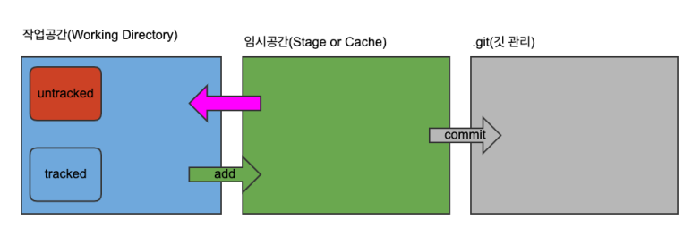

git stash : 내가 쓰던 코드들 올라가게 → 현재 코드 가리는거임

: 현재 작업 중인 변경 사항(아직 커밋 안 한 것들)을 임시 저장소에 숨김

git stach pop : 임시공간에서 작업공간으로 다시 들고옴 (충돌이 안나면 알아서 drop해주는데 충돌이 발생하면 충돌해결하고  git stash drop을 해줘야함!!) 

git pull upstream 브랜치명 : 코드를 올리기 전에 항상 이걸 먼저 해서 충돌을 방지

→ remote 명으로 등록(remote로 주소 바꿀 수 있음) upstream은 내가 fork한 원본 저장소이고 origin은 내 원격 저장소

git fetch --prune : github에서 삭제된 것을 내 컴퓨터 내에서도 삭제시키는 명령어

git status(git 상태)

git branch [브랜치명] : branch 생성

git switch [브랜치명] : git branch 이동

git switch -c [브랜치명] : 브랜치 생성과 이동 동시에(git checkout과 비슷한 구조?)

mileston : GitHub 기능으로 이슈(Issue)와 PR을 묶어서 관리하는 기능

git submodule -init

git submodule : 비밀 상태 (따로 존재하는것으로 cd로 이동) 밖에서도 commit해줘야함 기존 해시값이 아닌 바뀐 것을 바라보게끔

git reset

- hard: 특정 커밋ID로 돌아간 후 이력은 완전히 제거
- soft: 커밋ID로 돌아간 후 이력은 임시공간(staging or cache)로 이동
- mixed: 커밋ID로 돌아간 후 이력은 작업공간(working directory)로 이동

git reflog : 

- 지금까지 참조된 이력을 보여주는 명령어로 reflog 자체가 커밋을 복구하진 않습니다.
- reset --hard로 지워진 커밋도 여기엔 기록이 남아있음. 실수로 날렸을 때 여기서 커밋 ID 찾아서 복구 가능

git rebase :

- 커밋 히스토리를 정리하거나 수정할 때 유용한 명령어

이미지 추가해서 올리는 법(이미지 폴더 만들어서 같이 올리는 것이 좋음)
- 같은 폴더에 있을 때: <!---->
- images 폴더 안에 있을 때: <!---->
